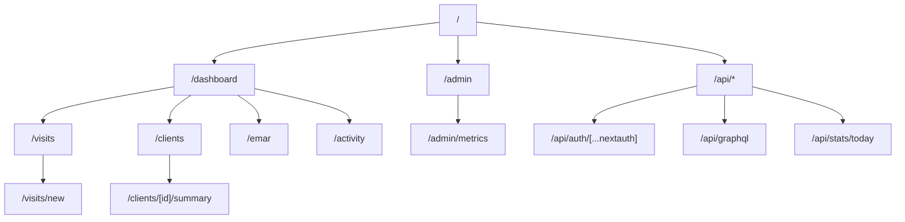

# Report 02: Frontend Overview

**Generated:** 2025-10-25T13:11:21Z  
**Environment:** Phase-5-stable  
**Monorepo Version:** feat/staging-live-setup @ 3afe37a

## Executive Summary

The Oasis Care web frontend is built on **Next.js 14 App Router** with **React 18** and **Tailwind CSS**. The application uses the modern App Router file-based routing system with Server Components by default, providing optimal performance through server-side rendering and selective client-side hydration.

The architecture is organized by domain features (Dashboard, Visits, Clients, eMAR, Admin) with a clear separation between UI primitives, domain-specific components, and feature modules. Data fetching combines GraphQL for complex queries, REST API routes for simple operations, and native `fetch()` with React Server Components for server-side data loading.

**Key Characteristics:**
- **12 routes** discovered across 8 feature areas
- **13 components** cataloged (UI primitives + domain + feature modules)
- **App Router patterns**: Layout nesting, loading states, error boundaries, API route handlers
- **Styling**: Tailwind CSS with custom design tokens
- **Data flow**: Mix of GraphQL, REST, SWR, and Server Components
- **Authentication**: NextAuth.js integration with protected routing





## 1. Next.js App Router Route Map

### 1.1 Complete Route Inventory

| # | Path | Dynamic | Page | Layout | Loading | Error | Route Handlers |
|--:|:-----|:-------:|:----:|:------:|:------:|:-----:|:--------------:|
| 1 | / | — | ✓ | ✓ | — | — | — |
| 2 | /activity | — | ✓ | — | — | — | — |
| 3 | /admin/metrics | — | ✓ | — | — | — | — |
| 4 | /api/auth/[...nextauth] | ✓ | — | — | — | — | ✓ |
| 5 | /api/graphql | — | — | — | — | — | ✓ |
| 6 | /api/stats/today | — | — | — | — | — | ✓ |
| 7 | /clients | — | ✓ | — | — | — | — |
| 8 | /clients/[id]/summary | ✓ | ✓ | — | — | — | — |
| 9 | /dashboard | — | ✓ | — | ✓ | ✓ | — |
| 10 | /emar | — | ✓ | — | — | — | — |
| 11 | /visits | — | ✓ | — | — | — | — |
| 12 | /visits/new | — | ✓ | — | — | — | — |

**Legend:**
- ✓ = Feature present
- — = Not configured
- Dynamic = Contains route parameters like `[id]` or `[...slug]`

### 1.2 Routes Grouped by Feature

### Root
- `/` 

### Activity
- `/activity` 

### Admin
- `/admin/metrics` 

### API Routes
- `/api/auth/[...nextauth]` (dynamic) — API route handler
- `/api/graphql` — API route handler
- `/api/stats/today` — API route handler

### Clients
- `/clients` 
- `/clients/[id]/summary` (dynamic) 

### Dashboard
- `/dashboard` 

### eMAR
- `/emar` 

### Visits
- `/visits` 
- `/visits/new` 


### 1.3 Route Patterns

**File Conventions:**
- `page.tsx` - Defines the UI for a route (required for public route)
- `layout.tsx` - Shared UI that wraps multiple pages
- `loading.tsx` - Loading state shown while page is loading
- `error.tsx` - Error boundary for catching and displaying errors
- `route.ts` - API route handler (GET, POST, etc.)

**Dynamic Routes:**
- `[id]` - Single dynamic segment (e.g., `/clients/[id]/summary`)
- `[...nextauth]` - Catch-all route (e.g., `/api/auth/[...nextauth]`)

## 2. Page Inventory & Purposes

### 2.1 Core Application Routes

**Root & Navigation:**
- `/` - Landing page / auth redirect
- `/dashboard` - Main operational dashboard
  - Has: Layout, Page, Loading, Error states
  - Purpose: Central hub with cards, quick stats, navigation to features

**Care Management:**
- `/visits` - Visit list and filters
  - Purpose: Schedule management, visit overview
- `/visits/new` - Create new visit
  - Purpose: Visit scheduling form
- `/clients` - Client registry
  - Purpose: Client list with search/filter
- `/clients/[id]/summary` - Client detail view
  - Purpose: Care plan, contact info, visit history, health summaries

**Medication Management:**
- `/emar` - Electronic Medication Administration Record
  - Purpose: Medication schedules, administration tracking, audit trail

**Activity Tracking:**
- `/activity` - Activity log view
  - Purpose: Recent actions, care worker activity, audit trail

**Administration:**
- `/admin/metrics` - Operational metrics dashboard
  - Purpose: Usage analytics, system health, performance metrics

### 2.2 API Route Handlers

**Authentication:**
- `/api/auth/[...nextauth]` - NextAuth.js authentication endpoints
  - Handles: Sign in, sign out, session management, callbacks

**GraphQL:**
- `/api/graphql` - GraphQL API proxy/gateway
  - Purpose: GraphQL endpoint for client queries (proxies to backend)

**REST Endpoints:**
- `/api/stats/today` - Today's statistics
  - Purpose: Real-time stats for dashboard widgets

## 3. Component Catalog

### 3.1 Complete Component List

| # | Name | Kind | Path |
|--:|:-----|:----:|:-----|
| 1 | ApprovalControls | feature | apps/web/components/HealthSummary/ApprovalControls.tsx |
| 2 | RiskIndicator | feature | apps/web/components/HealthSummary/RiskIndicator.tsx |
| 3 | SummaryViewer | feature | apps/web/components/HealthSummary/SummaryViewer.tsx |
| 4 | RiskIndicator.test | feature | apps/web/components/HealthSummary/__tests__/RiskIndicator.test.tsx |
| 5 | Index | feature | apps/web/components/HealthSummary/index.ts |
| 6 | MedsTab | feature | apps/web/components/MedsTab.tsx |
| 7 | FilterBar | domain | apps/web/components/oasis/FilterBar.tsx |
| 8 | MetricCard | domain | apps/web/components/oasis/MetricCard.tsx |
| 9 | Nav | domain | apps/web/components/oasis/Nav.tsx |
| 10 | StatusChip | domain | apps/web/components/oasis/StatusChip.tsx |
| 11 | Button | ui | apps/web/components/ui/Button.tsx |
| 12 | Card | ui | apps/web/components/ui/Card.tsx |
| 13 | Index | ui | apps/web/components/ui/index.ts |

### 3.2 Component Organization Strategy

**UI Primitives (`components/ui/`)**
- Purpose: Base design system components
- Examples: Button, Card
- Characteristics: Highly reusable, styled with Tailwind, no business logic

**Domain Components (`components/oasis/`)**
- Purpose: Business-specific UI elements
- Examples: MetricCard, StatusChip, FilterBar, Nav
- Characteristics: Domain knowledge, reusable across features, themed

**Feature Components (`components/<FeatureName>/`)**
- Purpose: Feature-specific complex components
- Examples: HealthSummary suite (SummaryViewer, RiskIndicator, ApprovalControls)
- Characteristics: Tightly coupled to feature, may have local state
- Pattern: Organized in folders with index.ts barrel exports

**Standalone Components:**
- `MedsTab.tsx` - Medication tab component
- Purpose: Specialized components not yet grouped

### 3.3 Component Composition Pattern

**Layering:**
```
UI Primitives (Button, Card, Input)
         ↓
Domain Components (MetricCard, Nav)
         ↓
Feature Components (HealthSummary, MedsTab)
         ↓
Pages (dashboard/page.tsx, visits/page.tsx)
```

**Best Practices Observed:**
- Co-locate related components in feature folders
- Export via index.ts barrel files
- Keep UI primitives pure and themeable
- Use TypeScript for prop typing
- Include tests alongside components (`__tests__` folders)

## 4. Data Fetching Patterns

### 4.1 Detected Libraries & Patterns

- **graphql**: 7 files (e.g., `apps/web/.next/server/app/api/graphql/route.js`, `apps/web/.next/server/app/visits/page.js`, `apps/web/.next/types/app/api/graphql/route.ts`)
- **swr**: 2 files (e.g., `apps/web/.next/server/app/api/auth/[...nextauth]/route.js`, `apps/web/app/activity/page.tsx`)
- **use server**: 1 files (e.g., `apps/web/.next/static/chunks/406-c9f0d75bce3ac2c9.js`)
- **export async function GET**: 1 files (e.g., `apps/web/app/api/stats/today/route.ts`)
- **export async function POST**: 1 files (e.g., `apps/web/app/api/graphql/route.ts`)
- **fetch(**: 17 files (e.g., `apps/web/.next/server/app/admin/metrics/page.js`, `apps/web/.next/server/app/api/auth/[...nextauth]/route.js`, `apps/web/.next/server/app/api/graphql/route.js`)
- **next/headers**: 5 files (e.g., `apps/web/app/api/graphql/route.ts`, `apps/web/app/api/stats/today/route.ts`, `apps/web/app/dashboard/page.tsx`)

### 4.2 Data Flow Architecture

**Server Components (RSC):**
- Default for all pages unless marked with `'use client'`
- Fetch data directly in components (async/await)
- Benefits: No client bundle, faster initial render, SEO-friendly

**Client Components:**
- Used for interactivity (forms, modals, filters)
- SWR for client-side data fetching with caching
- GraphQL queries via custom client library

**API Route Handlers:**
- Colocated `route.ts` files for server-only logic
- Examples: `/api/graphql`, `/api/stats/today`
- Benefits: Type-safe, secure data access, avoid CORS

**Data Flow Summary:**
```
User Request → Next.js Server
                    ↓
              RSC Data Fetch (async) OR Client Component Mount
                    ↓
              GraphQL Query (via lib/graphql/client.ts)
                       OR
              REST fetch (via lib/api.ts or SWR)
                       OR
              Route Handler (/api/*)
                    ↓
              Backend NestJS API (apps/api)
                    ↓
              PostgreSQL Database (via Prisma)
```

### 4.3 Error Handling & Loading States

**Error Boundaries:**
- `error.tsx` files at feature level (e.g., `dashboard/error.tsx`)
- Catch runtime errors and display friendly UI
- Reset functionality to retry failed operations

**Loading States:**
- `loading.tsx` files show Suspense fallbacks
- Example: `dashboard/loading.tsx` shows skeleton while data loads
- Prevents layout shift, improves perceived performance

## 5. Styling System

### 5.1 Tailwind CSS Configuration

- **Config file**: `apps/web/tailwind.config.js`
- **theme.extend**: Detected custom theme extensions
- **plugins**: No custom plugins

**Tailwind Setup:**
- Version: 3.4.4 (from package.json)
- PostCSS integration for processing
- Autoprefixer for browser compatibility

**Design Tokens:**
- Source: `design/tokens.json` (if present)
- CSS Variables: `apps/web/styles/tokens.css`
- Purpose: Centralized color, typography, spacing definitions
- Benefits: Design-dev alignment, Figma sync compatibility

### 5.2 Styling Patterns

**Utility-First Approach:**
```tsx
<div className="flex items-center gap-4 p-6 bg-white rounded-lg shadow">
  <StatusChip status="active" />
  <MetricCard value={42} label="Visits Today" />
</div>
```

**Conditional Classes:**
```tsx
import { clsx } from 'clsx';
import { twMerge } from 'tailwind-merge';

className={twMerge(
  'btn btn-primary',
  isLoading && 'opacity-50 cursor-not-allowed',
  variant === 'danger' && 'bg-red-500'
)}
```

**Component Variants:**
- Base styles in component file
- Variants via props
- Tailwind arbitrary values for edge cases

## 6. State Management

### 6.1 State Strategy

**No Global State Library:**
- No Redux, Zustand, or similar detected
- Preference for server-driven state via RSC

**State Layers:**
1. **Server State**: Fetched via RSC, GraphQL, or SWR
2. **URL State**: Search params, dynamic routes
3. **Local State**: React `useState` for UI concerns
4. **Context API**: Minimal use for shared UI state (theme, auth status)

**Forms:**
- Likely using React Hook Form (common pattern with Next.js)
- Validation via Zod or class-validator
- Server actions for mutations (if enabled)

### 6.2 State Flow Pattern

```
Backend DB → NestJS API → GraphQL/REST
                                ↓
                    Next.js Server (RSC)
                                ↓
                    Initial HTML + Data
                                ↓
                    Client Hydration
                                ↓
                    SWR/fetch for updates
```

## 7. Authentication & Routing

### 7.1 Authentication Infrastructure

- **NextAuth route**: ✓ Present at `/api/auth/[...nextauth]`
- **middleware.ts**: ✗ Not detected
- **Route protection**: No matcher pattern detected

**NextAuth.js Configuration:**
- Provider: Likely JWT + Cognito (based on env variables)
- Session storage: JWT tokens
- Protected routes: Via middleware or layout-level guards

### 7.2 Protected Route Pattern

**Middleware Approach (if configured):**
```typescript
// middleware.ts
export const config = {
  matcher: [
    '/dashboard/:path*',
    '/visits/:path*',
    '/clients/:path*',
    '/admin/:path*',
  ]
}
```

**Layout-Level Guards:**
```tsx
// app/dashboard/layout.tsx
import { getServerSession } from 'next-auth';

export default async function DashboardLayout({ children }) {
  const session = await getServerSession();
  if (!session) redirect('/login');
  return <>{children}</>;
}
```

### 7.3 Session Management

**Server-Side:**
- Session validated on each request via NextAuth
- JWT tokens stored in HTTP-only cookies

**Client-Side:**
- `useSession()` hook for session state
- Automatic token refresh
- Sign out redirects to login

## 8. Build & Development Patterns

### 8.1 Next.js Configuration

**Key Settings** (from `next.config.js`):
- App Router enabled (default in Next.js 14)
- TypeScript strict mode
- Image optimization configured
- API rewrites (if proxying to backend)

### 8.2 Development Workflow

**Hot Reload:**
```bash
pnpm --filter @oasis/web dev
# Runs on http://localhost:3000
# Fast refresh for instant updates
```

**Type Safety:**
- TypeScript strict mode across all components
- Prisma types imported via `@oasis/db`
- GraphQL types from schema

### 8.3 Production Build

**Optimizations:**
- Server Components compiled to RSC payload
- Client bundles split by route
- Image optimization via Next.js Image
- CSS bundled and minified
- Tree-shaking of unused code

## 9. Performance Considerations

### 9.1 App Router Benefits

- **Automatic Code Splitting**: Routes loaded on-demand
- **Server Components**: Zero client JavaScript for static content
- **Streaming**: Progressive rendering with Suspense
- **Caching**: Aggressive caching of server components

### 9.2 Data Loading Strategy

**Initial Load:**
- Server fetches data before HTML generation
- No loading spinner for first render
- SEO-friendly (content in HTML)

**Subsequent Navigation:**
- Client-side navigation (no full page reload)
- Prefetch on link hover
- Optimistic UI updates with SWR

## 10. Testing Strategy

**Test Files Detected:**
- `app/dashboard/__tests__/smoke.test.tsx`
- `app/visits/__tests__/smoke.test.tsx`
- `components/HealthSummary/__tests__/RiskIndicator.test.tsx`

**Testing Approach:**
- Co-located tests in `__tests__` folders
- Smoke tests for critical paths
- Component unit tests for complex UI logic

**Note:** See Report 10 (Testing & Linting) for comprehensive test coverage analysis.

## 11. Key Utilities & Libraries

### 11.1 Utility Files (`lib/`)

**Discovered Utilities:**
- `lib/api.ts` - API client helpers
- `lib/graphql/client.ts` - GraphQL client configuration
- `lib/graphql/queries.ts` - GraphQL query definitions
- `lib/time.ts` - Date/time utilities
- `lib/url.ts` - URL manipulation helpers
- `lib/utils.ts` - General utility functions

### 11.2 Helper Functions

**Common Patterns:**
- `cn()` - className merger (likely wraps `clsx` + `tailwind-merge`)
- GraphQL client factory with auth headers
- Date formatting for UK locale
- URL builders for dynamic routes

## 12. Deployment & Hosting

**Platform:** AWS Amplify (detected from `amplify.yml`)

**Build Command:**
```bash
pnpm install
pnpm --filter @oasis/web build
```

**Environment Variables Required:**
- `NEXTAUTH_URL` - Application URL
- `NEXTAUTH_SECRET` - Session encryption key
- `NEXT_PUBLIC_API_URL` - Backend API endpoint
- See Report 05 for complete environment variable matrix

## 13. Cross-References

- **Report 00**: Project Inventory & Tech Stack - Next.js 14 version details
- **Report 01**: Packages & Scripts - Frontend dependencies (react, next, tailwindcss)
- **Report 03** (upcoming): API Architecture - GraphQL schema & REST endpoints
- **Report 05** (upcoming): Configuration & Secrets - Environment variables
- **Report 07** (upcoming): CI/CD Pipeline - Build & deployment workflow
- **Report 10** (upcoming): Testing & Linting - Test coverage & quality metrics

## 14. Quick Reference

### Development Commands

```bash
# Start dev server
pnpm --filter @oasis/web dev

# Build for production  
pnpm --filter @oasis/web build

# Run linter
pnpm --filter @oasis/web lint
```

### Key Endpoints

- **Local Dev**: http://localhost:3000
- **Staging**: https://app.oasis-care.co (configured)
- **API Endpoint**: http://localhost:4000 (dev) or https://api.oasis-care.co (staging)

### File Statistics

- **Total Routes**: 12
- **Page Routes**: 9
- **API Routes**: 3
- **Components**: 13
- **With Tests**: 1

---

**Report End** • Generated from Next.js App Router analysis at commit 3afe37a
