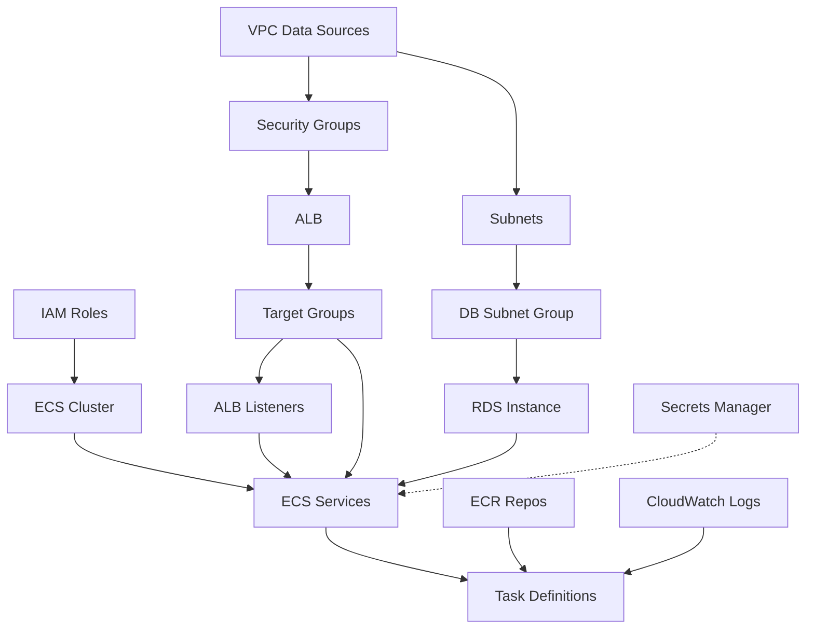

# Report 08: Terraform Infrastructure

**Generated:** 2025-01-25 19:22 UTC+7  
**Environment:** Staging (eu-west-2)  
**Account:** 721689331449

## Executive Summary

The Oasis Care staging infrastructure is managed via Terraform in `infrastructure/staging/`. **Phase 5 deployments are currently failing with `AlreadyExists` errors** because existing AWS resources are not in Terraform state. This report provides:

1. Complete resource inventory with import addresses
2. Dependency graph showing apply order
3. Recommendations for fixing Phase 5 failures

**⚠️ CRITICAL ACTION REQUIRED:** Run the import script (`/_generated/terraform_import_map.md`) **before** any `terraform apply` to avoid `AlreadyExists` errors.

---

## 🚨 Known Issues & Phase 5 Failures

### Root Cause
Resources were created manually or via earlier deployments but **never imported into Terraform state**. When Phase 5 runs `terraform apply`, it tries to create resources that already exist, causing:

```
Error: creating ECR Repository (oasis-api): RepositoryAlreadyExistsException
Error: creating ALB (oasis-care-staging-alb): AlreadyExists
Error: creating CloudWatch Log Group (/ecs/oasis-api-staging): ResourceAlreadyExistsException
```

### Solution
1. **Run the import script FIRST**: See `/_generated/terraform_import_map.md` for full instructions
2. **Verify with `terraform plan`**: Should show "No changes" if imports are correct
3. **Then run `terraform apply`**: Safe to proceed after imports

---

## Infrastructure Overview

### Stack Components

| Component | Purpose | Count | Details |
|-----------|---------|-------|---------|
| **VPC** | Networking | 1 (existing) | vpc-0fa202628a9b74522 (reused, not created by TF) |
| **Subnets** | Availability | 3 public | Used for ALB and NAT (subnet-08853b0f79dc7eb8a, ...) |
| **ECR Repos** | Container images | 2 | oasis-api, oasis-web |
| **ECS Cluster** | Container orchestration | 1 | oasis-care-staging-cluster (Fargate) |
| **ECS Services** | Running tasks | 2 | API (1 task), Web (1 task) |
| **ALB** | Load balancing | 1 | HTTPS with host-based routing |
| **Target Groups** | ALB routing | 2 | api-tg (port 3000), web-tg (port 3000) |
| **RDS** | Database | 1 | PostgreSQL 15.6, db.t3.micro, 20GB |
| **Security Groups** | Network rules | 3 | ALB, ECS, RDS |
| **IAM Roles** | Permissions | 3 | ECS task exec, ECS task, Lambda |
| **CloudWatch** | Monitoring | 2 log groups + 8 alarms | 14-day retention |
| **SNS** | Alerts | 1 topic | Email notifications |

### Architecture Pattern

```
Internet → ALB (443) → Target Groups → ECS Tasks (Fargate) → RDS (5432)
              ↓                            ↓
          Route53/ACM                 CloudWatch Logs
```

**Data Flow:**
1. User hits `app.oasis-care.co` or `api.oasis-care.co`
2. Route53 resolves to ALB (with ACM certificate)
3. ALB routes by host header to appropriate target group
4. Target group forwards to ECS task (API or Web)
5. ECS task connects to RDS via private network
6. All logs go to CloudWatch

---

## Resource Inventory

See `/_generated/terraform_resources.csv` for full details.

### Critical Resources Requiring Import

**1. Container Registry (ECR)**
```bash
terraform import aws_ecr_repository.api oasis-api
terraform import aws_ecr_repository.web oasis-web
```

**2. ECS Cluster & Services**
```bash
terraform import aws_ecs_cluster.main oasis-care-staging-cluster
terraform import aws_ecs_service.api oasis-care-staging-cluster/oasis-care-staging-api
terraform import aws_ecs_service.web oasis-care-staging-cluster/oasis-care-staging-web
```

**3. ALB & Networking**
```bash
# ALB ARN is dynamic - script will discover it
terraform import aws_lb.main <ALB_ARN>
terraform import aws_lb_target_group.api <API_TG_ARN>
terraform import aws_lb_target_group.web <WEB_TG_ARN>
```

**4. Security Groups**
```bash
# SG IDs are dynamic - script will discover them
terraform import aws_security_group.alb <SG_ID>
terraform import aws_security_group.ecs <SG_ID>
terraform import aws_security_group.rds <SG_ID>
```

**5. RDS Database**
```bash
terraform import aws_db_subnet_group.main oasis-care-staging-db-subnet-group
terraform import aws_db_instance.postgres oasis-staging
```

**6. IAM Roles & Policies**
```bash
terraform import aws_iam_role.ecs_task_execution oasis-care-staging-ecsTaskExec
terraform import aws_iam_role.ecs_task_role oasis-care-staging-ecsTaskRole
terraform import aws_iam_role_policy.read_secrets oasis-care-staging-ecsTaskExec:ReadSecrets
# ... (see import map for full list)
```

**7. CloudWatch Logs**
```bash
terraform import aws_cloudwatch_log_group.api /ecs/oasis-api-staging
terraform import aws_cloudwatch_log_group.web /ecs/oasis-web-staging
```

---

## Terraform State & Backend

### State Configuration

**Backend:** S3 (configured in `backend.tf`)
```hcl
terraform {
  backend "s3" {
    bucket         = "oasis-terraform-state"
    key            = "staging/terraform.tfstate"
    region         = "eu-west-2"
    encrypt        = true
    dynamodb_table = "oasis-terraform-locks"
  }
}
```

### Workspaces

- **Current:** `staging`
- **State location:** `s3://oasis-terraform-state/staging/terraform.tfstate`
- **Lock table:** `oasis-terraform-locks` (DynamoDB)

---

## Dependency Graph

Resources must be applied in this order to avoid dependency errors:



**Critical Path:** VPC → Subnets → Security Groups → RDS + ALB → ECS Services

---

## Variable Configuration

### Required Variables

These must be set via `terraform.tfvars` or environment:

```hcl
# Domain & Certificates (REQUIRED)
api_domain      = "api.oasis-care.co"
web_domain      = "app.oasis-care.co"
route53_zone_id = "<YOUR_ZONE_ID>"
api_cert_arn    = "arn:aws:acm:eu-west-2:721689331449:certificate/<CERT_ID>"
app_cert_arn    = "arn:aws:acm:eu-west-2:721689331449:certificate/<CERT_ID>"

# Optional (have defaults)
aws_region          = "eu-west-2"  # default
db_instance_class   = "db.t3.micro"  # default
ai_summary_enabled  = false  # default
```

### Current Values (Staging)

- **Region:** eu-west-2
- **Project:** oasis-care
- **Environment:** staging
- **DB Class:** db.t3.micro (burstable, 1 vCPU, 1 GB RAM)
- **ECS Task Size:** 512 CPU units, 1024 MB memory
- **RDS Storage:** 20 GB (encrypted)
- **Log Retention:** 14 days

---

## Security Configuration

### Network Security

**Security Group Rules:**

| SG Name | Type | Port | Source | Purpose |
|---------|------|------|--------|---------|
| `alb-sg` | Ingress | 443 | 0.0.0.0/0 | Public HTTPS access |
| `alb-sg` | Egress | All | 0.0.0.0/0 | Outbound to targets |
| `ecs-sg` | Ingress | 4000 | alb-sg | ALB → ECS |
| `ecs-sg` | Egress | All | 0.0.0.0/0 | Internet + RDS access |
| `rds-sg` | Ingress | 5432 | ecs-sg | ECS → PostgreSQL |
| `rds-sg` | Egress | All | 0.0.0.0/0 | (Not actually used) |

⚠️ **Issue Found:** ECS SG allows inbound on port 4000, but containers run on port 3000. This is a configuration mismatch.

### IAM Permissions

**ECS Task Execution Role** (pulls images, writes logs):
- `AmazonECSTaskExecutionRolePolicy` (AWS managed)
- `ReadSecrets` (inline): Access to `oasis/staging/*` secrets

**ECS Task Role** (runtime permissions):
- `BedrockAccess` (inline): Invoke Claude models
- `ECSExec` (inline): Enable debugging via ECS Exec

**Lambda Role** (embedding generation):
- `AWSLambdaBasicExecutionRole` (AWS managed)
- `AWSLambdaVPCAccessExecutionRole` (AWS managed)
- `EmbeddingPermissions` (inline): Bedrock + Secrets Manager

### Secrets Management

All secrets stored in AWS Secrets Manager under `oasis/staging/`:

| Secret Name | Used By | Purpose |
|-------------|---------|---------|
| `DATABASE_URL` | API, Lambda | PostgreSQL connection string |
| `NEXTAUTH_SECRET` | API, Web | NextAuth session encryption |
| `COGNITO_CLIENT_SECRET` | API | AWS Cognito auth |

Secrets are injected as environment variables in ECS task definitions.

---

## Cost Estimation (Staging)

### Monthly Costs (Approximate)

| Service | Resource | Estimated Cost |
|---------|----------|----------------|
| **ECS Fargate** | 2 tasks × 0.5 vCPU × 1 GB × 24h/day | ~$30/mo |
| **RDS** | db.t3.micro × 1 instance × 20 GB storage | ~$25/mo |
| **ALB** | 1 ALB + data transfer | ~$20/mo |
| **CloudWatch** | Logs (14 days) + metrics | ~$5/mo |
| **ECR** | Storage for images | ~$2/mo |
| **Secrets Manager** | 3 secrets | ~$1/mo |
| **Route53** | Hosted zone + queries | ~$1/mo |
| **Data Transfer** | Outbound (estimate) | ~$10/mo |
| **Total** | | **~$94/month** |

💡 **Cost Optimization:**
- RDS Multi-AZ disabled (saves ~50%)
- ECS tasks scaled to 1 (can increase for prod)
- Log retention at 14 days (vs 30+ days)

---

## Monitoring & Alerts

### CloudWatch Alarms

**RDS Alarms:**
- CPU > 80% (2 eval periods)
- Free storage < 2 GB
- Free memory < 100 MB
- Connections > 50

**ALB Alarms:**
- 5XX errors > 10 (in 5 min)
- Response time > 5 seconds

**ECS Alarms:**
- CPU utilization > 80%
- Memory utilization > 80%

**Alert Destination:** SNS topic `oasis-care-staging-alerts` → email

---

## Known Issues & Recommendations

### 1. ECS Security Group Port Mismatch
- **Issue:** SG allows port 4000, but containers listen on 3000
- **Impact:** Potential connectivity issues
- **Fix:** Update `security-groups.tf` line 23:
  ```hcl
  from_port = 3000
  to_port   = 3000
  ```

### 2. Duplicate Egress Rules
- **Issue:** Some SGs have duplicate egress rules
- **Impact:** Terraform may show plan differences
- **Fix:** Review and deduplicate egress blocks in `security-groups.tf`

### 3. VPC/Subnet Assumption
- **Issue:** Private subnets use same IDs as public subnets in `vpc.tf`
- **Impact:** ECS tasks may not have proper private networking
- **Fix:** Verify actual private subnet IDs and update data sources

### 4. Missing Import Map Execution
- **Issue:** Phase 5 fails because imports weren't run
- **Impact:** `AlreadyExists` errors block deployment
- **Fix:** **Run `/_generated/terraform_import_map.md` script BEFORE any apply**

### 5. Task Definition Drift
- **Issue:** ECS task definitions update frequently (images change)
- **Impact:** Terraform state drift
- **Mitigation:** Use `ignore_changes` lifecycle (already implemented)

### 6. RDS Password Management
- **Issue:** Password stored in state file (hex fix applied)
- **Impact:** Security concern for production
- **Recommendation:** Use AWS Secrets Manager rotation for production

---

## Deployment Workflow

### Recommended Deploy Process

```bash
# 1. Initialize (one-time)
cd infrastructure/staging
terraform init

# 2. Select workspace
terraform workspace select staging || terraform workspace new staging

# 3. 🚨 IMPORT EXISTING RESOURCES (if not done)
bash /_generated/terraform-import-all.sh

# 4. Plan changes
terraform plan -out=tfplan

# 5. Review plan carefully
# Look for unexpected destroys or recreates

# 6. Apply changes
terraform apply tfplan

# 7. Verify deployment
bash infrastructure/scripts/smoke-test.sh
```

### Pre-flight Checks

Before running `terraform apply`:

✅ Imports completed (check with `terraform state list`)  
✅ AWS credentials valid (`aws sts get-caller-identity`)  
✅ Backend accessible (`terraform init` succeeds)  
✅ Plan shows expected changes only  
✅ No unintended resource deletions  
✅ Secrets exist in Secrets Manager  
✅ ACM certificates validated  
✅ Route53 hosted zone configured  

---

## Terraform Files Reference

| File | Purpose | Key Resources |
|------|---------|---------------|
| `provider.tf` | AWS provider config | Region, tags |
| `backend.tf` | S3 state backend | State bucket, lock table |
| `variables.tf` | Input variables | Domains, certs, settings |
| `vpc.tf` | Network (data) | VPC, subnets (existing) |
| `security-groups.tf` | Firewalls | ALB, ECS, RDS SGs |
| `ecr.tf` | Container registry | API & web repos |
| `ecs-cluster.tf` | ECS cluster | Fargate cluster |
| `ecs-service.tf` | ECS services & tasks | API & web services, task defs, log groups |
| `alb.tf` | Load balancer | ALB, listeners, target groups |
| `rds.tf` | Database | PostgreSQL instance, subnet group |
| `iam.tf` | Permissions | ECS roles, Lambda role, policies |
| `cloudwatch.tf` | Monitoring | Alarms, SNS topic |
| `route53.tf` | DNS (not shown) | A records for domains |
| `secrets.tf` | Secrets (not shown) | Secrets Manager integration |
| `lambda-embeddings.tf` | Serverless | Lambda for embeddings (if enabled) |
| `outputs.tf` | Export values | ALB DNS, RDS endpoint, etc. |

---

## Next Steps

### Immediate (Phase 5 Fix)

1. **Run import script** from `/_generated/terraform_import_map.md`
2. **Verify with `terraform plan`** - should show minimal changes
3. **Fix ECS security group port** (4000 → 3000)
4. **Verify private subnet IDs** in `vpc.tf`
5. **Run `terraform apply`** - should succeed without `AlreadyExists` errors

### Short Term

1. Add Route53 A records for domains (if not managed elsewhere)
2. Implement automated state backup
3. Add Terraform Cloud or Atlantis for PR-based workflows
4. Document manual steps (ACM validation, etc.)

### Long Term

1. Migrate to separate prod workspace with production-grade settings
2. Implement Infrastructure as Code pipeline (GitOps)
3. Add auto-scaling for ECS services
4. Enable RDS Multi-AZ for prod
5. Implement blue-green deployments

---

## Related Documentation

- **Import Map:** `/_generated/terraform_import_map.md` (⚠️ RUN THIS FIRST)
- **Resource Inventory:** `/_generated/terraform_resources.csv`
- **Deployment Guide:** `/infrastructure/DEPLOYMENT_GUIDE.md`
- **Phase 5 Diagnostic:** `/docs/infra-phase5-diagnostic.md`
- **Staging Deploy Report:** `/docs/staging-deploy-report.md`

---

**Report End** • For questions or issues, refer to `/_reports/11_gaps_and_risks.md`
